# Dokumentacja Szczegółowa: AI Drone WST Mikka Frame

**Lista części:**

- [Dokumentacja Szczegółowa: AI Drone WST Mikka Frame](#dokumentacja-szczegółowa-ai-drone-wst-mikka-frame)
  - [0. Wprowadzenie](#0-wprowadzenie)
    - [Opis](#opis)
    - [Pliki STL](#pliki-stl)
    - [Pliki CAD](#pliki-cad)
    - [TODO:](#todo)
    - [Pliki images](#pliki-images)
  - [1. FC\_holder](#1-fc_holder)
    - [Opis](#opis-1)
    - [Komponenty](#komponenty)
  - [2. bat\_holder](#2-bat_holder)
    - [Opis](#opis-2)
    - [Komponenty](#komponenty-1)
  - [3. free\_plate](#3-free_plate)
    - [Opis](#opis-3)
  - [4. arm\_holder](#4-arm_holder)
    - [Opis](#opis-4)
    - [TODO:](#todo-1)
  - [5. hc-sr04\_front\_holder](#5-hc-sr04_front_holder)
    - [Opis](#opis-5)
  - [6. hc-sr04\_side\_holder](#6-hc-sr04_side_holder)
    - [Opis](#opis-6)
  - [7. arm](#7-arm)
    - [Opis](#opis-7)
    - [Komponenty](#komponenty-2)
  - [8. raspberry\_pi\_5](#8-raspberry_pi_5)
    - [Opis](#opis-8)
  - [9. Seeed-Studio-XIAO-ESP32-C3](#9-seeed-studio-xiao-esp32-c3)
    - [Opis](#opis-9)
  - [10. hc sr04](#10-hc-sr04)
    - [Opis](#opis-10)
    - [TODO:](#todo-2)
  - [11. Rechargable Lithium Battery 18650](#11-rechargable-lithium-battery-18650)
    - [Opis](#opis-11)
    - [TODO:](#todo-3)

## 0. Wprowadzenie

### Opis

AI Drone Frame V2 to projekt ramy drona zaprojektowanej z myślą o druku 3D, kompletnej modularności i montażu do którego potrzeba minimalnej wiedzy technicznej.

Układ komponentów widoczny na zrzutach ekranu jest absolutnie dowolny - każdy komponent można przemieścić, dodać nowy lub pominąć.

Aby ułatwić customizację wszystkie pliki CAD są umieszczone w folderze [CAD](./CAD/).

Jeśli chcesz wydrukować swojego drona na naszej bazie, wszystkie potrzebne pliki .stl znajdują się w folderze [STL](./STL/).

### Pliki STL

Pliki STL nazywane są w następujący sposób:

```
[nazwa_modelu]-[wersja]-[wariant]-[data].stl
```

**gdzie:**

- `[nazwa_modelu]` - dokładna nazwa komponentu
- `[wersja]` - numer wersji w formacie: `iteracja.zmiana.poprawka`
- `[wariant]` - (opcjonalnie) `m` dla wersji odbitej (mirrored)
- `[data]` - w formacie `ddmmyyyy`

**Przykład:**  
`motor_holder-1.1.0-m.stl` oznacza:

- Komponent: `motor_holder`
- Wersja: `1.1.0` (pierwsza iteracja, pierwsza zmiana, bez poprawek)
- Odbity `m`

_Ostatnia zmiana: 14.02.2026_

### Pliki CAD

### TODO:

- [ ] dokumentacja CAD

### Pliki images

Pliki images nazywane są w następujący sposób:

```
[nazwa_modelu]-[środowisko]-[rodzaj_zrzutu].png
```

**gdzie:**

- `[nazwa_modelu]` - dokładna nazwa komponentu
- `[środowisko]` - `workspace` dla zrzutów ekranu z programu CAD, `real` dla zdjęć rzeczywistych modeli, `render` dla renderów
- `[rodzaj_zrzutu]` - `solo` dla zrzutów ekranu z samym modelem, `outline` dla zrzutów ekranu z modelem i jego obrysem

## 1. FC_holder

### Opis

FC_holder to element konstrukcyjny któy służy do montażu ESP32 lub raspberry Pi do ramy drona. Otwartość konstrukcji ma pomagać w prawidłowym chłodzeniu FC.

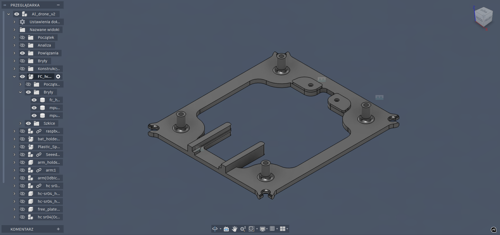

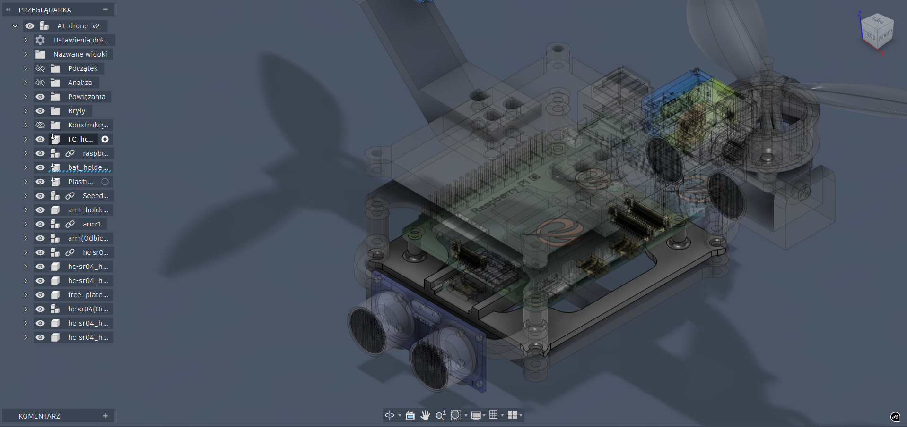
_Ostatnia zmiana: 12.02.2026_

### Komponenty

- #### mpu6050_rubber_spacer
  Gumowa podkładka do montażu mpu6050 mająca na celu redukcję drgań i poprawę stabilności pomiarów. Druk z TPU, zalecane niepełne wypełnienie dla lepszej elastyczności.
  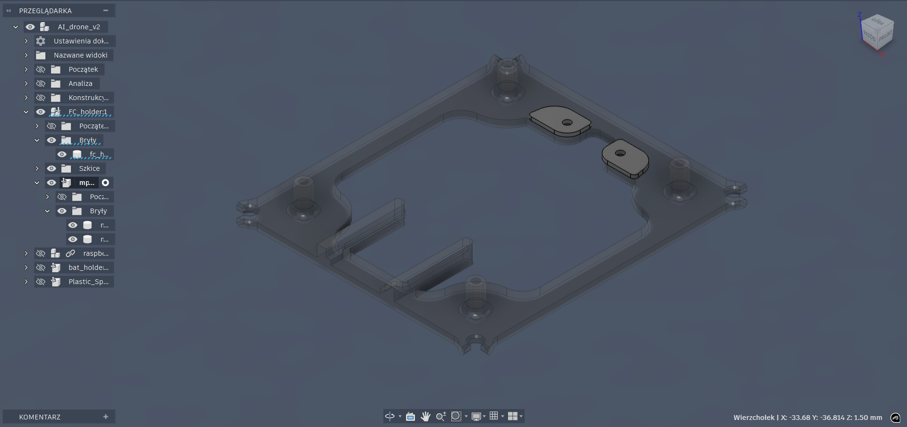
  _Ostatnia zmiana: 12.02.2026_

## 2. bat_holder

_Ostatnia zmiana: 12.02.2026_

### Opis

bat_holder to element służący do montażu baterii, w połączeniu z spacerem pozwala na zamontowanie baterii za pomocą paska z rzepem lub trytytką.

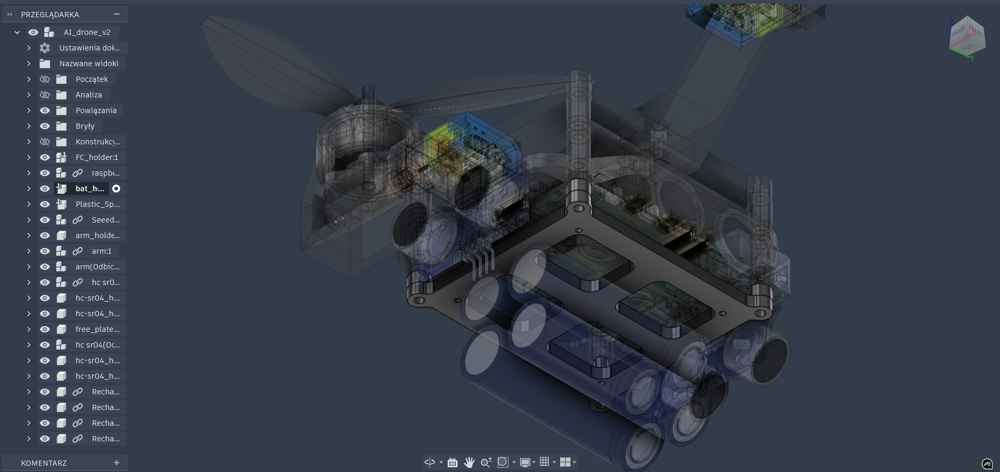

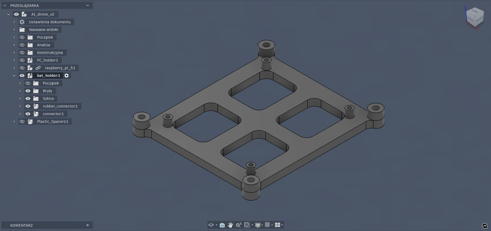

### Komponenty

- #### rubber_connector

  Gumowy connector ma pomóc w redukcji drgań konstrukcji. Drukowane z TPU, tworzy przestrzeń między wyższymi komponentami umożliwiając przełożenie paska z rzepem lub trytytki.
  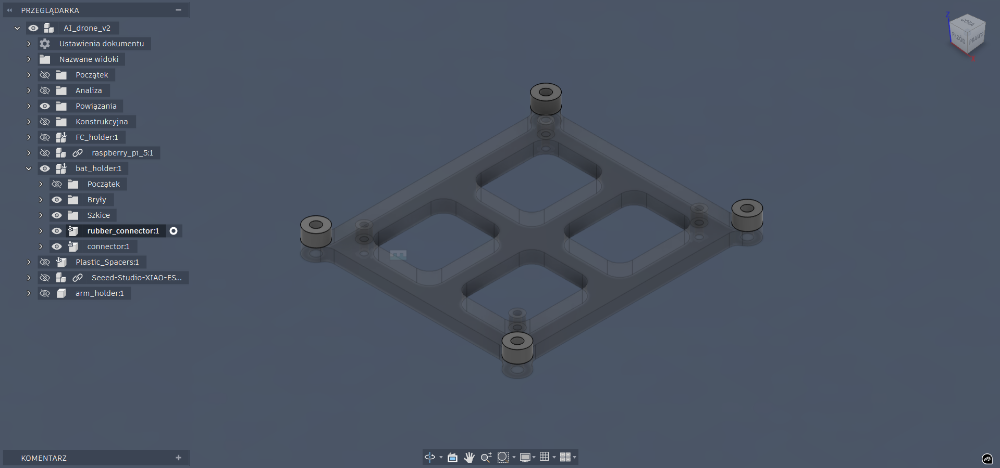
  _Ostatnia zmiana: 12.02.2026_

- #### connector

  **Element opcjonalny** <br>
  Plastikowy connector do przedłużenia mocowania Raspberry Pi, co może pomóc w redukcji drgań na całym [FC_holder](#1-fc_holder).
  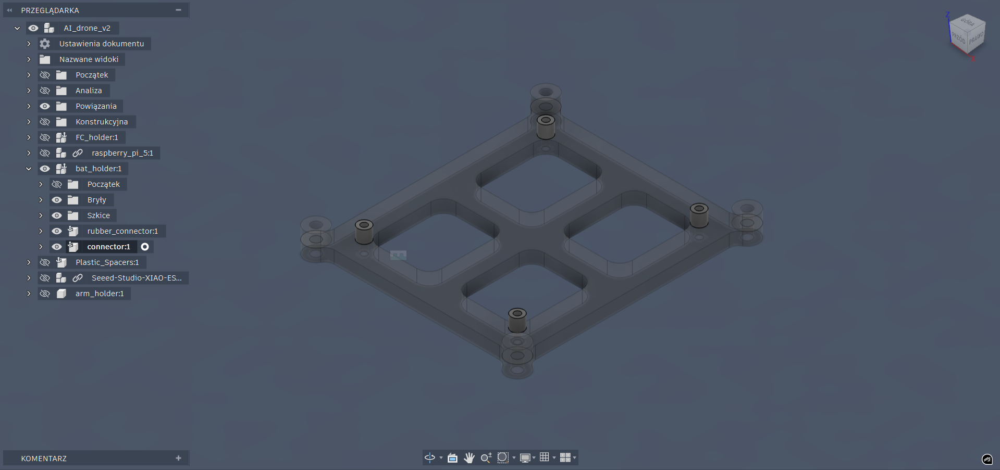
  _Ostatnia zmiana: 12.02.2026_

## 3. free_plate

### Opis

free_plate to element który może służyć do motażu dodatkowej elektroniki lub jako dodatkowa przestrzeń montażowa.

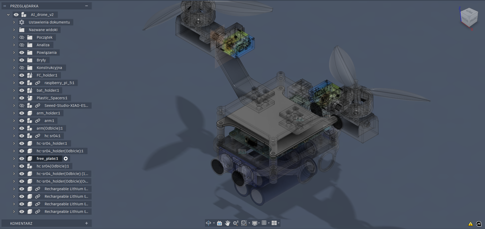
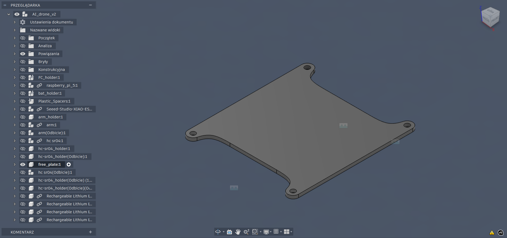
_Ostatnia zmiana: 14.02.2026_

## 4. arm_holder

### Opis

arm_holder to element który służy do montażu ramion drona za pomocą trzech śrub i nakrętek na ramie. Zdecydowanie najcięższy element konstrukcji, być może niepotrzebnie.

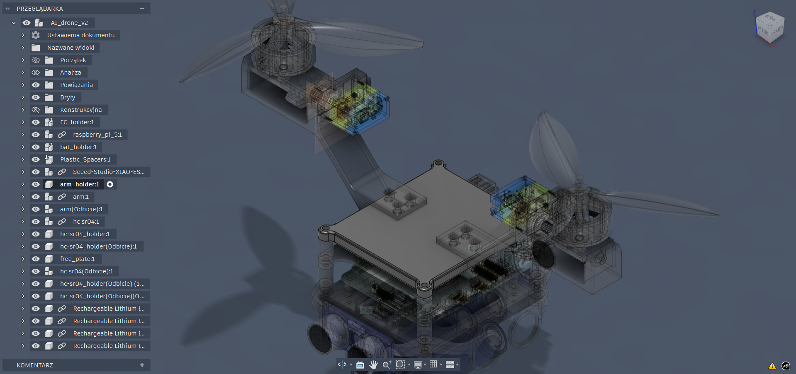
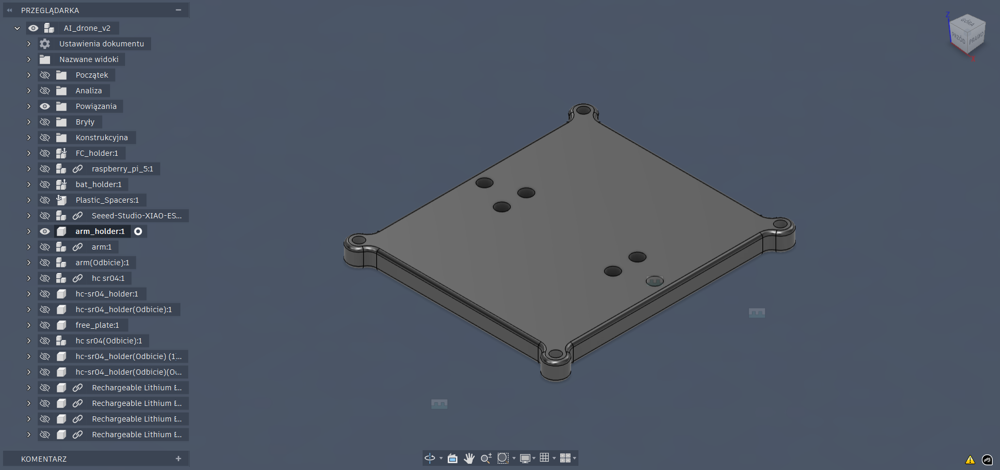

### TODO:

- [ ] redukcja masy

_Ostatnia zmiana: 14.02.2026_

## 5. hc-sr04_front_holder

### Opis

hc-sr04_front_holder to element trzymający przedni i tylni ultradźwiękowy czujnik zbliżeniowy. Minimalistyczna i super lekka konstrukcja.

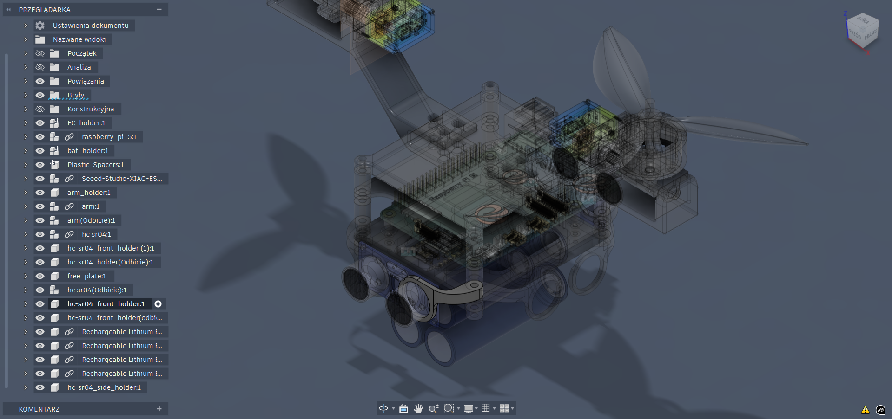
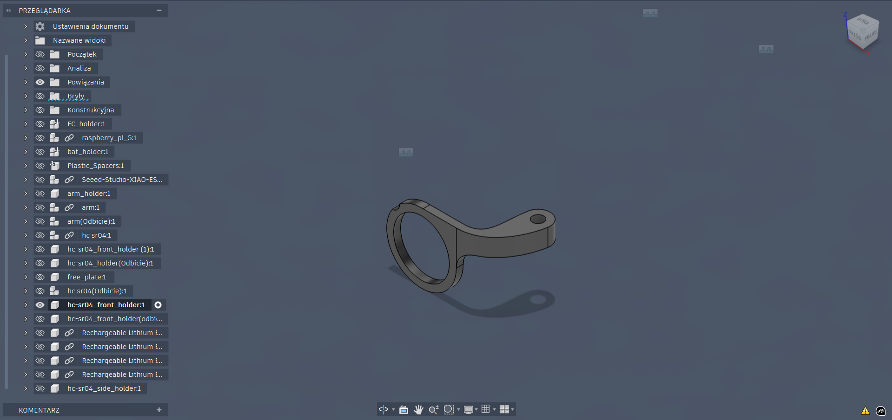
_Ostatnia zmiana: 14.02.2026_

## 6. hc-sr04_side_holder

### Opis

hc-sr04_side_holder to element trzymający boczne ultradźwiękowe czujniki zbliżeniowe. Minimalistyczna i super lekka konstrukcja. **To nie jest ten sam element co [hc-sr04_front_holder](#5-hc-sr04_front_holder), mimo że wyglądają podobnie.**

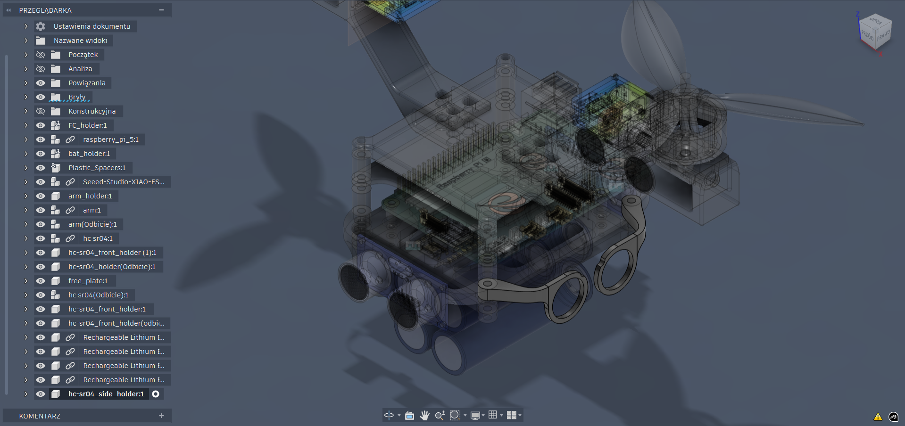
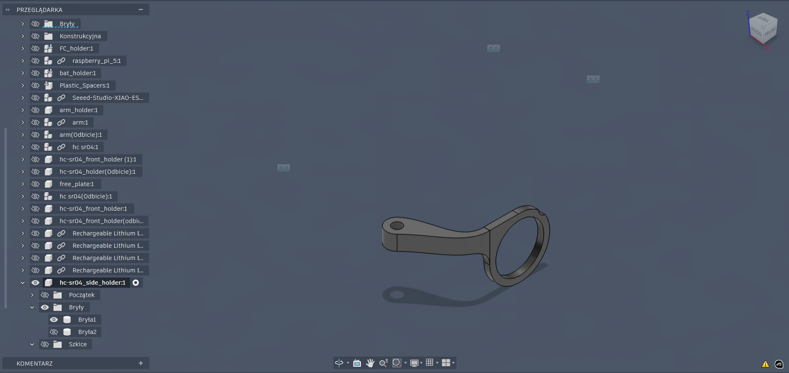
_Ostatnia zmiana: 14.02.2026_

## 7. arm

### Opis

Najsolidnijesza część całej konstrukcji, utrzymuje motor z servem nieruchomo. Servo przykręcamy dwoma śrubami po lewej i prawej stronie alementu.

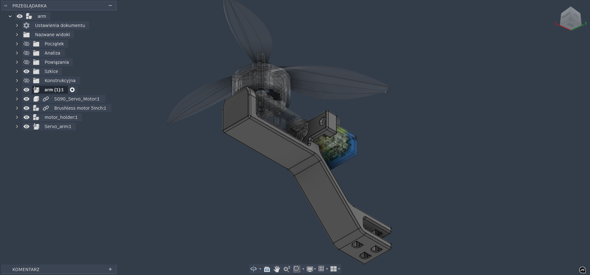
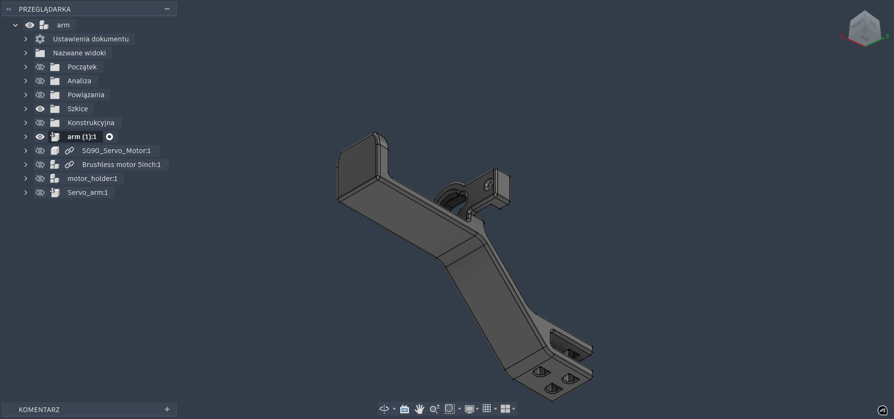
_Ostatnia zmiana: 14.02.2024_

### Komponenty

- #### motor_holder

  Zdecydowanie najbardziej skomplikowany element całej ramy. Trzyma bezszczotkowy motor i zapewnia obrót za pomocą serva.

  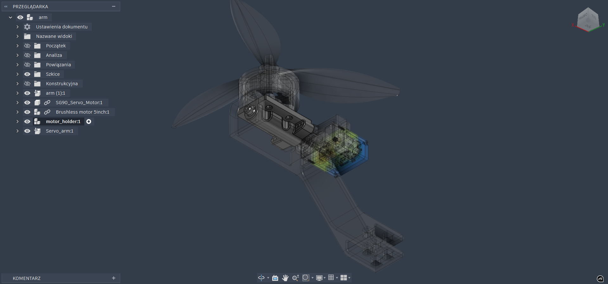
  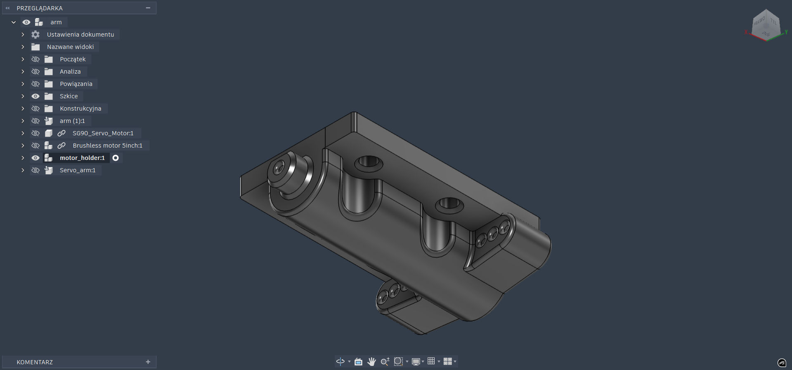
  _Ostatnia zmiana: 14.02.2024_

- #### Servo_arm

  Komponent pomocniczy, odpowiada ramieniu serva którego nie udało znaleźć się na internecie.
  _Ostatnia zmiana: 14.02.2024_

- #### Brushless motor 5inch

  Komponent pomocniczy do pełnej wizuaizacji. Zaprojektowany i zamodelowany w ramach pomysłu na stworzenie własnych motorów (i nie wiedziałem jeszcze o GrabCadzie :c).

- #### SG90_Servo_Motor
  Model pobrany za darmo z [GrabCad](https://grabcad.com/library/sg90-servo-motor-module-for-arduino-1) autorstwa [Wonil Kim](https://grabcad.com/wonil.kim-1). Model jest używany tylko jako placeholder i doskonała referencja do rozstawu otworów montażowych.

## 8. raspberry_pi_5

### Opis

Model pobrany za darmo z [GrabCad](https://grabcad.com/library/raspberry-pi-5-2) autorstwa [Mateusz Zelek](https://grabcad.com/mateusz.zelek-1). Model jest używany tylko jako placeholder i doskonała referencja do rozstawu otworów montażowych.

## 9. Seeed-Studio-XIAO-ESP32-C3

### Opis

Model pobrany za darmo z [GrabCad](https://grabcad.com/library/seeed-studio-xiao-esp32-c3-1) autorstwa [Maurice Pannard](https://grabcad.com/maurice.pannard-1). Model jest używany tylko jako placeholder i doskonała referencja do rozstawu otworów montażowych.

## 10. hc sr04

### Opis

Model pobrany za darmo z [GrabCad](https://grabcad.com/library/hc-sr04-ultrasonic-sensor-12) autorstwa [NITHISH CADEX](https://grabcad.com/nithish.cadex-1). Model jest używany tylko jako placeholder i doskonała referencja do rozstawu otworów montażowych.

### TODO:

- [ ] dolny holder

## 11. Rechargable Lithium Battery 18650

### Opis

Model pobrany za darmo z [GrabCad](https://grabcad.com/library/18650-li-ion-cell-2) autorstwa [Edoardo Azzolin](https://grabcad.com/edoardo.azzolin-2). Model jest używany tylko jako placeholder i doskonała referencja do rozstawu otworów montażowych.

### TODO:

- [ ] uwzględnić w modelu kontener na dwa akumulatory
