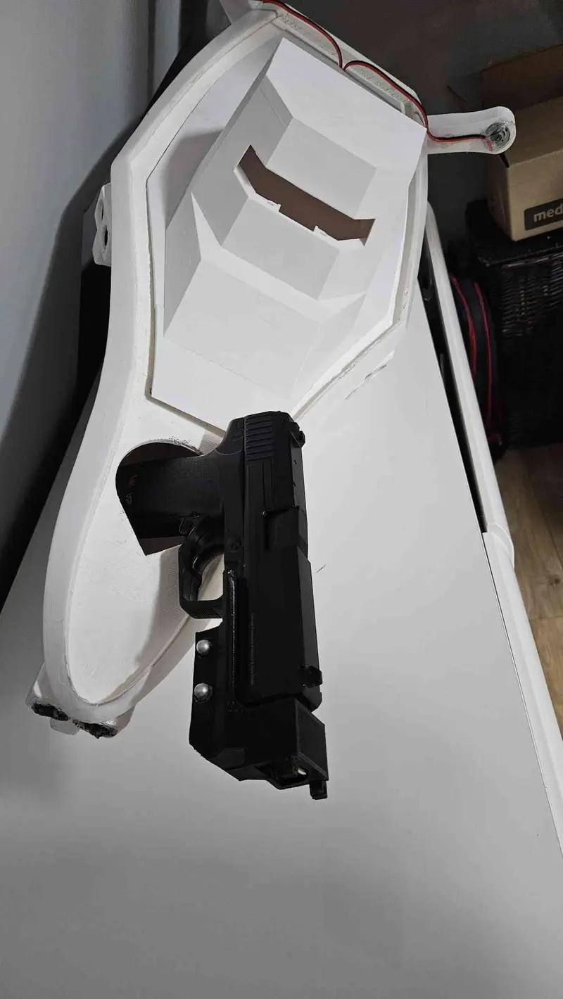
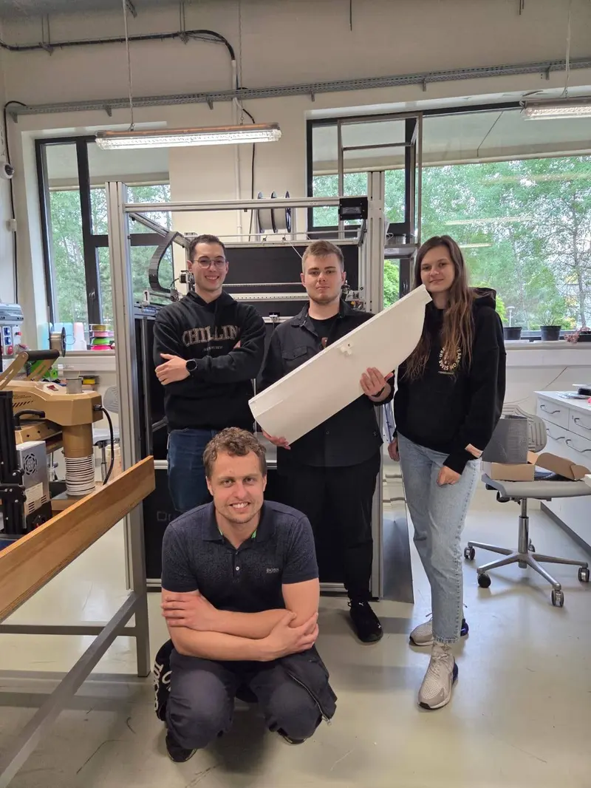
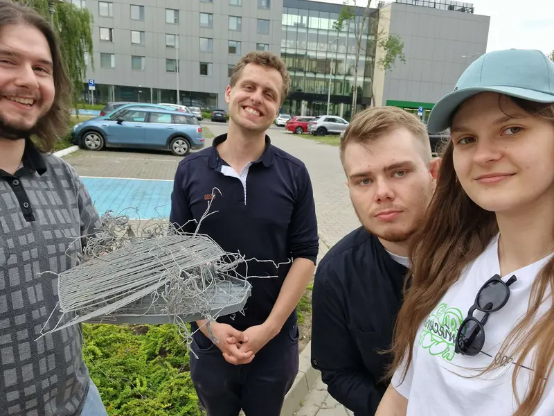

# WST - Weird Steering Things 🚀🌊

**WST (Weird Steering Things)** is an advanced, gloriously over-engineered, and fundamentally unreasonable take on making things move. It is an open-source framework built to prove that the sweet spot of engineering lies exactly where "genuinely useful" meets "utterly insane."

While the rest of the industry begs you to buy proprietary, locked-down flight controllers that cost as much as a small car, we choose to build our own from scratch using $5 microcontrollers and sheer willpower. Why? **Because we can.** Does it make sense? Not even a little bit. But we really like the smell of fresh code and the occasional sound of exploding capacitors.

---

## 🌀 The "Why": A Manifesto of Experimental Madness

WST was born from a simple, dangerous question: *What happens if we stop being sensible?* We realized that standard drone and boat kits are "black boxes"—boring, restricted, and way too expensive for what they actually do. **WST is our rebel shout against that.** This project is a massive evolution of our previous work, **XR BINIU** (Mixed Reality Blended Intelligence for Navigable Interactive UV's). We took the solid research from that project and decided to dial the "weirdness" up to eleven.

We are building a system that allows a neural network, trained inside a high-fidelity **Unity 6** simulation, to pilot a physical vehicle in the real world. Whether it’s a drone tethered by a kilometer-long fiber optic cable or a boat navigating via a VPN hosted on a **Raspberry Pi**, WST provides the tools to make it happen. You don't even need a fancy RC controller—if you have a smartphone and a dream, you're in.

  

## 🧠 The Philosophy: "Because We Can"

Our guiding principles completely ignore market trends in favor of absolute experimental chaos:

* **Democratic Insanity**: We run core flight logic on **ESP32** or **Arduino** boards. Our rule is simple: If the microcontroller has enough RAM to blink an LED, we’re going to try and make it fly, swim, or crawl.
* **The Great Separation**: We have strictly decoupled the **Flight Controller** (the "Muscle" handling PWM and raw sensors) from the **Flight Computer** (the "Brain" running AI and high-level logic). This means the "Brain" can be a powerful PC in another country, while the "Muscle" is a tiny chip in a plastic hull.
* **Open Connectivity Overdose**: Why rely on boring 2.4GHz radio when you can use **WiFi, high-speed fiber optics, or insanely long USB cables**? If it can carry a data packet, we will use it to steer something weird. 
* **The Fun Factor**: If a construction is "too sensible," it’s not a WST project. We empower you to build the most "stupidly brilliant" designs for tasks that absolutely shouldn't exist. We are here for the "Wait, it actually works?!" moments.

---

## 🏗️ Technical Architecture: The "Magic" Under the Hood

The architecture is built on the **Breadboard Interface** concept—a modular legacy from the XR BINIU project. By treating every hardware component as a "Virtual Sensor" or "Virtual Motor," we achieve a seamless, reality-bending transition from the digital world to the physical one.

### 1. The Flight Computer
* **Training Environment**: Built in **Unity 6 (HDRP)**. We use high-fidelity physics to simulate water, wind, and the sheer unpredictability of nature.
* **Unity ML-Agents Toolkit**: We use Reinforcement Learning to teach our agents how to navigate. We don't code the steering; we let the AI "fail upward" until it masters the art of moving weird things.
* **Sim2Real Pipeline**: We simulate complex buoyancy and wave physics so that when the neural network moves from the screen to the pond, it doesn't have a mental breakdown.

### 2. The Flight Controller
* **Logic**: Handled by **ESP32/Arduino** using highly optimized C# scripts and low-level C++ code.
* **ICommunicationInterface**: This is the secret sauce—a real-time bridge that links the Unity "Brain" to the physical "Muscle" via WebSockets or VPN tunnels.
* **VPN Gateway**: Using a **Raspberry Pi** as a gateway, we can control our "weird things" across global networks. Distance is just a number.

---

## 🚀 Join the Madness

This project is big, it is complex, and it is—by any traditional standard—completely ridiculous. But it’s also the most fun you can have with a soldering iron and a Unity license. 

* **Main Repo**: [github.com/DAXPL/WST](https://github.com/DAXPL/WST)

### 👥 The "Weird" Team (Authors)
* **inż. Adam Mischke** – Electronics Specialist. Master of the $5 flight controller and survivor of the exploding capacitors.
* **Cosinus** – Unity 3D Programmer & Code Quality Guardian. She’s the silent force ensuring our GitHub repository doesn't descend into chaos, keeping our code clean and professional while we're busy breaking things.
* **Emil Kopytek** – Bicopter Architect & 3D Printing. Designing things that fly in ways nature never intended.
* **inż. Krystian Olesiejko** – Naval Architect & 3D Printing Specialist. Hull designer and manufacturing lead.
* **Mateusz Nawrot** – Network Specialist & C++ Programmer. Keeping the VPN tunnels open. Fiberglass enjoyer.
* **inż. Miłosz Klim** – Project Leader, Unity Developer, C++ Developer. The one who asks "Why not?" when things start smoking.
* **Wiktoria Bielecka** – UI/UX Designer & Aesthetic Overlord. She is the only person standing between us and a project that looks like a 1995 Linux terminal. Wiktoria spends her days bravely fighting the engineers' urge to use "default gray" and making sure that even if the vehicle is doing something "weird," it does so with a perfectly aligned and beautiful interface.
* **Google Gemini** – The ghost in the machine. Artificial intelligence keeping track of our genuine human stupidity.

  

  

### 🎖️ Special Thanks

* **Dr. Wojciech Czart** – Advisor of the **Errno** Student Science Club. Logistical support in digital realities and AI.
* **Wielkopolska Centre for Advanced Technologies (WCZT)** – For granting access to large-format 3D printers and supporting the project with a massive amount of filament.
---
*Developed with passion, excessive amounts of caffeine, and a healthy dose of madness at the Faculty of Physics and Astronomy, Adam Mickiewicz University. We also have Emil from PK and Majster from <uzupełnij @majster>*